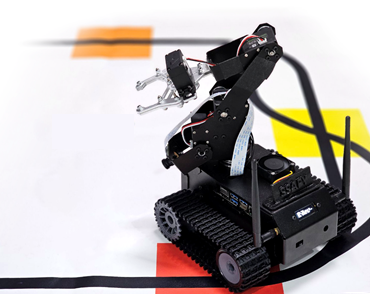

# 무인운반차량 재활용 쓰레기 자동 분리수거 프로젝트
> 무인운반차량(AGV) 인공지능을 활용하여 재활용 쓰레기를 인식하고 분리수거하는 프로젝트입니다.



## 기술 스택


## 1)인공지능 무인운반차량(AGV)
인공지능 무인운반차량(AGV)의 가장 큰 역할은 인공지능과 Computer Vision을 이용하여 Working Area 사이에서 물류를 운반하는 역할이다. GUI 원격 제어기로  command를 입력하면 MQTT를 이용해 명령을 읽어서 동작을 수행한다. 창작 활동으로 다양한 센서를 덧붙여 GUI 원격 제어기에 sensing data 를 보낼 수 있다.
## 2)GUI 원격 제어기
GUI 원격 제어기는 Raspberry Pi 5 + Qt 로 만들어진다.
GUI 원격 제어기는 아래와 같이 크게 두 가지 기능을 갖고 있습니다.
1. 실시간 모니터링
2. AGV 원격 제어

참고) python 버전 ( 2024.11.13 기준 )
 - AGV : python 3.6.9
 - Rpi5 : python 3.11
 - Qt Creator : python 3.12
원격 제어기의 가장 중요한 역할은 스스로 통제 불능에 빠지거나 전혀 예상하지 못한 환경에 처한 인공지능 무인운반차량(AGV)을 다시 정상 상태로 복귀 시키는 것이다.
추가적으로 GUI 원격 제어기를 통해 인공지능 무인운반차량(AGV)으로부터 다양한 sensing data 와 Camera로 촬영한 화면 영상을 직접 보면서 인공지능 무인운반차량(AGV)의 현 상황을 체크할 수 있는 모니터의 역할도 수행할 수 있다.
## 3)Cloud Database
Cloud Database의 역할은 GUI 원격 제어기로부터 받은 Data를 저장하고, Data를 전송하여 Web Visualization을 수행하는 역할이다. 우리는 Firebase 기반의 Cloud Database 를 운영하여 서버리스 방식으로 서버를 운영한다. 
## 4)OpenAI API 를 이용한 로그 데이터 분석
DB에 쌓이는 데이터를 OpenAI 의 API를 이용해 GPT 모델로 분석을 시킨다. 
분석을 통해 현재 AGV가 어떤 상황에 처해 있는 지를 분석할 수 있으며, 유효하지 않은 데이터를 분석할 수 있다. 해당 분석을 통해 사용자에게 추가적인 안내를 할 수도 있다.
```sh
npm install my-crazy-module --save
```

윈도우:

```sh
edit autoexec.bat
```

## 사용 예제

스크린 샷과 코드 예제를 통해 사용 방법을 자세히 설명합니다.

_더 많은 예제와 사용법은 [Wiki][wiki]를 참고하세요._

## 개발 환경 설정

모든 개발 의존성 설치 방법과 자동 테스트 슈트 실행 방법을 운영체제 별로 작성합니다.

```sh
make install
npm test
```

## 업데이트 내역

* 0.2.1
    * 수정: 문서 업데이트 (모듈 코드 동일)
* 0.2.0
    * 수정: `setDefaultXYZ()` 메서드 제거
    * 추가: `init()` 메서드 추가
* 0.1.1
    * 버그 수정: `baz()` 메서드 호출 시 부팅되지 않는 현상 (@컨트리뷰터 감사합니다!)
* 0.1.0
    * 첫 출시
    * 수정: `foo()` 메서드 네이밍을 `bar()`로 수정
* 0.0.1
    * 작업 진행 중

## 정보

이름 – [@트위터 주소](https://twitter.com/dbader_org) – 이메일주소@example.com

XYZ 라이센스를 준수하며 ``LICENSE``에서 자세한 정보를 확인할 수 있습니다.

[https://github.com/yourname/github-link](https://github.com/dbader/)

## 기여 방법

1. (<https://github.com/yourname/yourproject/fork>)을 포크합니다.
2. (`git checkout -b feature/fooBar`) 명령어로 새 브랜치를 만드세요.
3. (`git commit -am 'Add some fooBar'`) 명령어로 커밋하세요.
4. (`git push origin feature/fooBar`) 명령어로 브랜치에 푸시하세요. 
5. 풀리퀘스트를 보내주세요.

<!-- Markdown link & img dfn's -->
[npm-image]: https://img.shields.io/npm/v/datadog-metrics.svg?style=flat-square
[npm-url]: https://npmjs.org/package/datadog-metrics
[npm-downloads]: https://img.shields.io/npm/dm/datadog-metrics.svg?style=flat-square
[travis-image]: https://img.shields.io/travis/dbader/node-datadog-metrics/master.svg?style=flat-square
[travis-url]: https://travis-ci.org/dbader/node-datadog-metrics
[wiki]: https://github.com/yourname/yourproject/wiki
